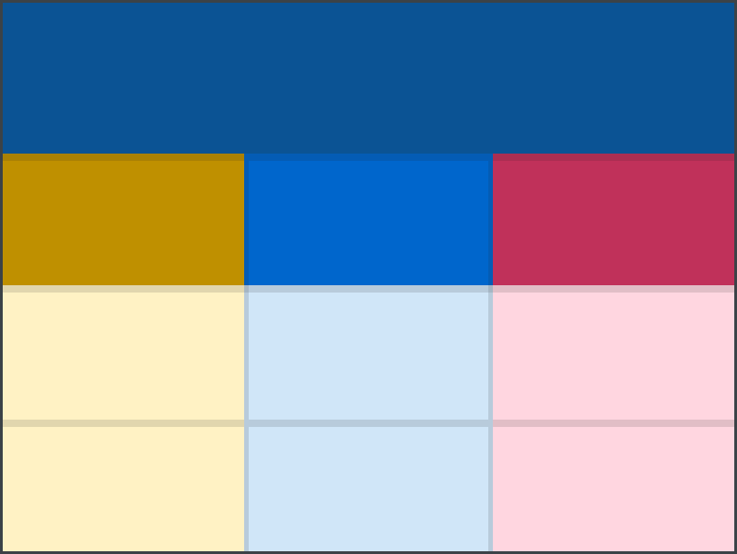

<p align="center">
  
  <h1 align="center">TableBook</h1>
  <p align="center"><i>Generate spreadsheets with a declarative and structured table-based schema.</i><p>
</p>

## Table of Contents

1. [Project Overview](#project-overview)
2. [Using the Library](#using-the-library)
3. [TableBook Types](#types-of-tablebook)
4. [TableBook Functions and Utilities](#tablebook-functions-and-utilities)

## **Project Overview**

### **What is TableBook?**

`TableBook` is a TypeScript library for generating spreadsheets programmatically from a declarative schema. It focuses on structured, column-based tables with one table per page, using a typing system to ensure consistent data. Instead of referencing individual cells, `TableBook` operates on individual columns with optional row selections, avoiding the complexities of traditional spreadsheets. This design ensures simplicity, consistency, and maintainability.

### **Key Features**

- **Declarative Schema**: Define `TableBook` objects in JSON or YAML for one-time or reusable spreadsheet generation.
- **Robust Parsing and Validation**:
  - JSON and YAML support with error reporting.
  - Type-safe validation ensures compliance with strict schemas.
- **Flexible Styling and Theming**:
  - Inherit or override themes with cascading styles for headers, groups, and columns.
  - Built-in palette support for consistent color schemes.
- **Advanced Data Selection**:
  - Column- and row-based selectors for precise targeting.
  - Support for complex expressions and rules.
- **Comprehensive API**:
  - Core utilities for parsing, validating, processing, and generating `TableBook` objects.

### **Example Use Cases**

1. **Automating Spreadsheet Creation**:
   - Define a schema once and programmatically generate structured spreadsheets for business or data processing workflows.
2. **Enforcing Schema Validation**:
   - Ensure that table data adheres to predefined rules, formats, and styles for consistency and reliability.
3. **LLM and UI Integration**:
   - Generate JSON or YAML schemas programmatically using natural language interfaces or user-friendly UIs.


---

## **Using the Library**

### **Installation**

To start using `TableBook`, install it via npm:

```bash
npm install tablebook
```

### **Basic Workflow**

`TableBook` provides a straightforward pipeline for working with table schemas:

1. **Parse**: Convert JSON or YAML into a `TableBook` object.
2. **Validate**: Ensure the parsed object adheres to the schema.
3. **Process**: Transform the `TableBook` into a `SheetBook` structure for output.
4. **Generate**: Use custom generators to produce spreadsheets.

---

### **Code Example: Simple End-to-End Workflow**

Here’s a complete example demonstrating how to parse, validate, process, and generate a `TableBook`.

```typescript
import { tablebook } from 'tablebook';

async function main() {
  // Sample TableBook JSON (normally loaded from a file or API)
  const tableBookJson = `
{
  "name": "Sales Report",
  "pages": [
    {
      "name": "Summary",
      "rows": 100,
      "schema": [
        {
          "name": "Revenue",
          "columns": [
            {
              "name": "Region",
              "type": { "kind": "text" }
            },
            {
              "name": "Sales",
              "type": { "kind": "numeric", "format": { "type": "currency", "symbol": "$" } }
            }
          ]
        }
      ]
    }
  ];
}`;

  // 1. Parse JSON into a TableBook object
  const parseResult = tablebook.parse('json', tableBookJson);

  if (!parseResult.success) {
    console.error('Parsing errors:', parseResult.info);
    return;
  }

  const parsedTableBook = parseResult.value;

  // 2. Validate the TableBook object
  const validateResult = tablebook.validate(parsedTableBook);

  if (!validateResult.success) {
    console.error('Validation errors:', validateResult.info);
    return;
  }

  const validTableBook = validateResult.value;

  // 3. Process the TableBook into a SheetBook
  const processResult = tablebook.process(validTableBook);

  if (!processResult.success) {
    console.error('Processing errors:', processResult.info);
    return;
  }

  const sheetBook = processResult.value;

  // 4. Generate a Google Sheet using a custom generator
  const generator = await tablebook.generators.google('user@example.com', 'API_KEY', 'SHEET_ID', true);

  const genResult = await generator.generate(sheetBook);

  if (!genResult.success)
    console.error('Generation errors:', genResult.info);
  else
    console.log('Spreadsheet generated successfully!');
}

```
---
---

## **Types of TableBook**

> **Note**: This section covers all types, structures, and concepts that form the declarative schema of a `TableBook`.

### Table of Contents

1. [TableSelector](#1-tableselector)
2. [TableReference](#2-tablereference)
3. [TableStyle](#3-tablestyle)
4. [TableHeaderStyle](#4-tableheaderstyle)
5. [TableTheme](#5-tabletheme)
6. [StandardPalette](#6-standardpalette)
7. [TableExpressions](#7-tableexpressions)
8. [TableDataType](#8-tabledatatype)
   - [8.1 TableConditionalStyle](#81-tableconditionalstyle)
   - [8.2 Rules Overview](#82-rules-overview)
   - [8.3 Text Type (`TableTextType`)](#83-text-type-tabletexttype)
   - [8.4 Enum Type (`TableEnumType`)](#84-enum-type-tableenumtype)
   - [8.5 Lookup Type (`TableLookupType`)](#85-lookup-type-tablelookuptype)
   - [8.6 Numeric Type (`TableNumericType`)](#86-numeric-type-tablenumerictype)
   - [8.7 Temporal Type (`TableTemporalType`)](#87-temporal-type-tabletemporaltype)
9. [TableUnit and Hierarchical Structure](#9-tableunit-and-hierarchical-structure)


---

## **1. TableSelector**

A **TableSelector** is how `TableBook` references data within a table. Instead of using direct spreadsheet cell references (e.g., `A1`), a `TableSelector` identifies:

1. A **column**
2. A selection of that column's **rows**

This structured approach ensures clarity and flexibility when working with tabular data.

---

### **1.1 How TableSelectors Work**

A `TableSelector` is either:

- **The string `"self"`** – referring to the current column and row in context.

- **An object** containing:
  - A `column` field (identifying the column).
  - A `rows` field (specifying which rows to select).

```typescript
type TableSelector =
  | "self"
  | {
      column: TableColumnSelector | "self";
      rows:   TableRowSelector    | "self";
    };
```

**Column Selection Rules:**
- If `column` is `"self"`, it refers to the current column.
- Otherwise, it must be a `TableColumnSelector`, which specifies a column by its `page`, `group`, and `name`.

**Row Selection Rules:**
- If `rows` is `"self"`, it refers to the current row.
- Otherwise, it must be a `TableRowSelector`, which defines how rows are chosen.

---

### **1.2 Column Selectors: Absolute vs. Relative**

A `TableColumnSelector` identifies a column within a table. Instead of referencing spreadsheet cell addresses like `A1`, it specifies **where the column is located** within a `TableBook` by using structured identifiers.

```typescript
type TableColumnSelector = {
  page?: string;  // Optional, specifies a page within the TableBook.
  group?: string; // Optional, specifies a column group.
  name: string;   // Required column name.
};
```

A column selector can be **absolute** or **relative**, depending on whether it explicitly includes a `page` and/or `group`.

---

### **Absolute Column Selectors**
An **absolute selector** fully specifies a column's location, ensuring that it always points to the same place regardless of context.

#### **Absolute Selector with Group (`page` + `group` + `name`)**
If both `page` and `group` are provided, the selector targets a **specific column within a group** on a specific page.

**Example:**
```typescript
{ page: "Summary", group: "Revenue", name: "Sales" }
```
- **Selects:** `"Sales"` inside the `"Revenue"` group on the `"Summary"` page.

This is the **most explicit selector**, guaranteeing that it resolves to the same column every time.

#### **Absolute Selector without Group (`page` + `name`)**
If `page` is provided **without** `group`, the selector targets a column **only within a TableColumnList** (a page without column groups).

**Example:**
```typescript
{ page: "Summary", name: "Sales" }
```
- **Selects:** `"Sales"` inside a **TableColumnList** on the `"Summary"` page.

This selector **only works on pages that use a TableColumnList**. If the page contains **groups**, this selector would be **invalid**, since a group would be required.

---

### **Relative Column Selectors**
A **relative selector** omits some details (`page`, `group`) and resolves based on **where it is used**.

#### **Relative Selector with Group (`group` + `name`)**
If a selector includes `group` but omits `page`, it selects a **column within a group on the current page**.

**Example:**
```typescript
{ group: "Revenue", name: "Sales" }
```
- **Selects:** `"Sales"` inside the `"Revenue"` group **on the current page**.

This selector is **valid on any page** that contains a `Revenue` group with a `Sales` column. If multiple pages share the same structure, the selector can be **reused across them**.

#### **Relative Selector Without Group (`name` Only)**
If a selector only includes `name`, it selects a **column within the current group and page**.

**Example:**
```typescript
{ name: "Sales" }
```
- **Selects:** `"Sales"` inside the **current group and page**.

This is **context-sensitive**. If multiple groups contain a `"Sales"` column, the selector resolves to the **nearest relevant group**.

For example, if `{ name: "Total" }` is used inside `"Sales"` (which belongs to `"Revenue"`), it will resolve to `"Total"` inside `"Revenue"`—not another `"Total"` column in an unrelated group.

This allows for **modular, reusable selectors** that work dynamically depending on context.

---

### **Key Takeaways**
- A **TableColumnSelector** identifies a column inside a table.
- **Absolute selectors** ensure that the same column is always selected:
  - **With `page` and `group`** → Column inside a **specific group** on a specific page.
  - **With `page` only** → Column inside a **TableColumnList** (pages without groups).
- **Relative selectors** depend on context:
  - **With `group` and `name`** → Column inside a group **on the current page**.
  - **With `name` only** → Column inside the **current group and page**.
- **Reusability**: Relative selectors allow references to be **shared across multiple pages** if the structure is consistent.

### **1.3 Row Selectors: Self, All, Unit, or Range**

A `TableRowSelector` defines which rows to include in the selection.

```typescript
type TableRowSelector = "self" | "all" | TableUnitSelector | TableRangeSelector;
```

| **Row Selector**         | **Meaning**                                     | **Example (A1 Equivalent in Column D)** |
|--------------------------|-------------------------------------------------|-----------------------------------------|
| `"self"`                 | Current row in context                         | `D3` (if on row 3).                    |
| `"all"`                  | Every row in the column                        | `D2:D` or `D3:D`                    |
| `"$n"`                   | Absolute row index (0-based)                   | `$0` => `D$2` or `D$3`                |
| `"+n"` / `"-n"`          | Relative to the current row                    | `D5` (if `+2` from row 3).             |
| `{ from: TableUnitSelector; to: TableUnitSelector }` |Selects a range of rows from a starting unit to an ending unit. | `D3:D6` (if on row 4 and `{to: "-1", from: '+3'}` ) |

#### **Unit Selectors**
A `TableUnitSelector` selects a specific row in the column:

```typescript
type TableUnitSelector = "$n" | "+n" | "-n";
```

- `"$0"`: First data row.
- `"$3"`: Fourth data row.
- `"+2"`: Two rows below the current row.
- `"-1"`: One row above the current row.

#### **Range Selectors**
A `TableRangeSelector` selects a range between two unit selectors:

```typescript
type TableRangeSelector = { from: TableUnitSelector; to: TableUnitSelector };
```

Example: `{ from: "$0", to: "$4" }` selects rows 0 through 4.

---

### **1.4 Single vs. Multiple Column Groups**

The structure of a table affects how row indices translate to A1 notation.
When there is a single group for a table, the group header row is not shown.

| **Table Structure**      | **Header Rows** | **First Data Row** | **Meaning of `$0` for A1 Column `A`** |
|--------------------------|---------------|-------------------|--------------------|
| **Single Group**         | Column headers only | Row 2          | `A2`               |
| **Multiple Groups**      | Group + Column headers | Row 3      | `A3`               |

Since `TableBook` supports multiple groups on a page, `$0` does **not always map to row 2**—it depends on whether group headers exist.

---

### **1.5 Examples**

#### **Example 1: Selector for All Rows in "Sales"**
```typescript
{ column: { name: "Sales" }, rows: "all" }
```
- **Resolves to**: Every row in `Sales` (e.g., `D2:D` in A1 notation if groupless).

---

#### **Example 2: Fully Qualified Selector**
```typescript
{
  column: { page: "Summary", group: "Revenue", name: "Sales" },
  rows: "$0"
}
```
- **Resolves to**: The first data row of `Sales` on the `Summary` page, `Revenue` group.

---

#### **Example 3: Relative Column with Explicit Group**
```typescript
{
  column: { group: "Revenue", name: "Sales" },
  rows: "$0"
}
```
- **Resolves to**: The first data row of `Sales` in the `Revenue` group, within the **current page**.

---

#### **Example 4: Relative Row Selector**
```typescript
{
  column: { name: "Profit" },
  rows: "+1"
}
```
- **Resolves to**: One row below the current row in the `Profit` column.

---

#### **Example 5: Range of Rows**
```typescript
{
  column: { name: "Sales" },
  rows: { from: "$0", to: "$4" }
}
```
- **Resolves to**: Rows 0 through 4 (inclusive) in `Sales` (e.g., `D2:D6`).

---

#### **Example 6: Self Reference**
```typescript
"self"
```
- **Resolves to**: The current column and row in context.

---

### **1.6 Key Takeaways**  

- A **TableSelector** always references **one column** + a **row subset**.  
- **Columns** can be:  
  - **Fully qualified** (`{ page, group, name }`)  
  - **Partially qualified** (`{ group, name }` or `{ name }`)  
  - **Flat column references** (`{ page, name }`) when selecting from a **TableColumnList**.  
- **Rows** can be:  
  - `"self"` (current row)  
  - `"all"` (all rows)  
  - **Absolute** (`"$n"`)  
  - **Relative** (`"+n"`, `"-n"`)  
  - **Range** (`{ from: "$0", to: "$4" }`)  
- **Headers are always included when using groups.**  
- **A table without headers must use a `TableColumnList` instead of groups.**  
- **Single-group tables also render group headers.**  
- **Selectors can target columns inside a group or a flat column list, depending on structure.**
---

## **2. TableReference**

The `TableReference` type enables reusable definitions in `TableBook`. It allows you to reference shared elements like colors, styles, or themes, ensuring consistency across your table schema.

#### **Definition**
```typescript
type TableReference = `@${string}`;
```

#### **Concept**
- A `TableReference` starts with `@`, followed by the key of the referenced item.
- These references point to predefined entries in the `definitions` object of the `TableBook`.

---
---

## **3. TableStyle**

The `TableStyle` type defines visual styling for text and backgrounds. It is a reusable element that can be applied wherever specific styling is required in a `TableBook`.

#### **TableColor**
A `TableColor` is a 6-digit hexadecimal color code that defines fixed colors.

```typescript
type TableColor = `#${string}`;
```

#### **TableStyle**
The `TableStyle` type allows customization of text and background appearance.

```typescript
type TableStyle = {
    fore?: TableColor | TableReference; // Text color.
    back?: TableColor | TableReference; // Background color.
    bold?: boolean;                     // Whether the text is bold.
    italic?: boolean;                   // Whether the text is italicized.
};
```
---
---

## **4. TableHeaderStyle**

The `TableHeaderStyle` type extends `TableStyle` to include border options. It is specifically used for styling table headers, such as group or column headers, to enhance visual structure.

---

#### **4.1 Definition**

```typescript
type TableHeaderStyle = TableStyle & {
    beneath?: TableBorder;  // Border beneath the header.
    between?: TableBorder;  // Border between groups or columns.
};
```

---

#### **4.2 TableBorder**

The `TableBorder` type defines the appearance of a border.

##### **Definition**
```typescript
type TableBorder = {
    type: TableBorderType;              // The line style of the border.
    color: TableColor | TableReference; // The color of the border.
};
```

##### **TableBorderType**
Represents the available styles for border lines:
```typescript
type TableBorderType =
    "none"  |
    "thin"  | "medium" | "thick"  |
    "dotted"| "dashed" | "double";
```

---
---

## **5. TableTheme**

A **TableTheme** defines coordinated styling for multiple areas - tabs, group headers, column headers, and data cells.
You can apply a theme at different levels of a `TableBook` (book → page → group → column), with each level either using or refining the theme from above.

#### **5.1 Definition**

```typescript
type TableTheme = {
  inherits?: TableReference[];
  tab?: TableColor | TableReference;
  group?: TableHeaderStyle | TableReference;
  header?: TableHeaderStyle | TableReference;
  data?: TableStyle | TableReference;
};
```

- **`inherits`**
  An ordered array of theme references. Each referenced theme is merged into the current theme one by one, so later themes override matching properties of earlier themes (property-by-property).

- **`tab`**
  The color or reference used for the spreadsheet’s tab.

- **`group`**
  The style or reference used for group headers (uses `TableHeaderStyle`).

- **`header`**
  The style or reference used for column headers (uses `TableHeaderStyle`).

- **`data`**
  The style or reference used for data cells (uses `TableStyle`).

---

#### **5.2 Flow from Book → Page → Group → Column**

Themes can be defined at any level of the `TableBook`. When a level has no theme, it simply keeps the one from above. If a level **does** define or reference a theme, that new theme merges its properties on top of whatever came before it. For example:

1. **Book Level**
   Set a global theme that applies to all pages by default.
2. **Page Level**
   Refine or replace the book theme if needed for that Page.
3. **Group Level**
   Further customize the group’s style.
4. **Column Level**
   Optionally refine the theme again, but only if specific columns require different looks.

---

#### **5.3 Example: Setting a Book Theme**

Below is an example of a **book-level** theme referencing the built-in **blue** palette. It then explicitly sets white, bold text for `group` and `header`:

```json
{
  "name": "MyReport",
  "theme": {
    "inherits": ["@blue"],
    "group": {
      "fore": "#FFFFFF",
      "bold": true
    },
    "header": {
      "fore": "#FFFFFF",
      "bold": true
    }
  },
  "pages": [
    {
      "name": "Summary",
      "schema": [
        {
          "name": "Revenue",
          "columns": [
            { "name": "Sales" },
            { "name": "Cost" }
          ]
        }
      ]
    }
  ]
}
```

- **`inherits: ["@blue"]`**
  Applies the `blue` palette (darkest → `group.back`, dark → `header.back`, main → `tab`, lightest → `data.back`).
- **`group` and `header`**
  Set their text color to `#FFFFFF` (white) and enable `bold`, ensuring high contrast on dark backgrounds.
- **Pages**, **Groups**, **Columns**
  All inherit from this book-level theme unless they specify their own.

---

#### **5.4 Default Book Theme**

A good starting theme for your TableBook allows you to use different palettes for each page while ensuring clarity and consistency. The following example sets a clean, bold look for group and header text, with clear dividing lines between groups and columns.

```json
{
   "name": "BookName",
   "theme": {
      "inherits": ["@gray"],
      "group": {
         "fore": "#FFFFFF",
         "bold": true,
         "between": { "type": "medium", "color": "#333333" }
      },
      "header": {
         "fore": "#FFFFFF",
         "bold": true,
         "between": { "type": "thin", "color": "#333333" }
      }
   }
}
```

---
---

## **6. StandardPalette**

**StandardPalette** provides a set of built-in color palettes, each containing five shades: `darkest`, `dark`, `base`, `light`, and `lightest`. You can reference an entire palette as a **theme** (e.g., `"@red"`) or reference its individual color shades (e.g., `"@red:darkest"`).

### **Using a Predefined Theme**

When you reference a palette by name for a **theme** (e.g., `"theme": "@blue"`), it brings in that entire palette for tab, group, header, and data. Specifically:

- `tab` gets the **base** color,
- `group.back` gets the **darkest** color,
- `header.back` gets the **dark** color,
- `data.back` gets the **lightest** color.

### **Using a Palette for a Specific Color**

If you want to use just a single shade from a palette in a style property (e.g. `fore` or `back`), you can specify `"@palette:shade"`. For example, `"@blue:darkest"`, `"@blue:light"`, etc. If you reference simply `"@blue"` as a color (without `:shade`), you get the **base** color of the palette.

### **Built-In Palettes**

```
Reds:
  - pink
  - cranberry
  - red

Oranges & Yellows:
  - rust
  - orange
  - yellow

Greens:
  - forest
  - green
  - sage
  - moss

Blues:
  - slate
  - teal
  - cyan
  - blue
  - azure
  - cerulean

Purples:
  - lavender
  - indigo
  - purple
  - plum
  - mauve

Neutrals:
  - coral
  - terracotta
  - bronze
  - sand
  - taupe
  - gray
  - charcoal
```

### **Examples**

1. **Use a Full Palette as a Theme**
   ```json
   {
     "name": "Report",
     "theme": "@blue",
     "pages": [ ... ]
   }
   ```
   This automatically applies the darkest, dark, base, lightest shades to `group.back`, `header.back`, `tab`, and `data.back` respectively.

2. **Reference a Specific Shade**
   ```json
   {
     "theme": {
       "group": { "back": "@blue:darkest" },
       "header": { "fore": "#FFFFFF", "back": "@blue:dark" },
       "data": { "back": "@blue:lightest" }
     }
   }
   ```
   This picks out specific colors (`darkest`, `dark`, `lightest`) from the `blue` palette.

---
---

## **7. TableExpressions**

Expressions in `TableBook` provide structured formulas that define computed values. Unlike traditional spreadsheets that use direct cell references (e.g. `A1`), expressions in TableBook are built from logical components—such as selectors, functions, comparisons, combinations, negations, and templates—that compile into final spreadsheet formulas.

Expressions fall into the following categories:

- **Literal values**: Fixed numbers or text.
- **Selectors**: References to data within a table.
- **Functions**: Named function calls with arguments.
- **Comparisons**: Binary comparisons using operators (e.g. `=`, `>`, `<`).
- **Combinations**: Arithmetic or string operations using operators (e.g. `+`, `-`, `&`).
- **Negation**: Inversion of an expression.
- **Templates**: Raw formula strings with placeholders for literal replacement.

---

#### **7.1 TableLiteralExpression**

A `TableLiteralExpression` is a fixed value that does not depend on other table data. It is simply a primitive value—either a string or a number.

```typescript
type TableLiteralExpression = string | number;
```

**Examples:**
- `"Approved"`
- `42`
- `"John Doe"`

---

#### **7.2 TableSelectorExpression**

A `TableSelectorExpression` references data dynamically using a selector. The selector defines a column (and a row subset) from which to retrieve a value. For instance, if the `"Revenue"` column is located in column D (with a group header), the selector might resolve to the cell range `D3:D` (depending on the current row context).

```typescript
const TableSelectorExpressionType = 'selector';
type TableSelectorExpression = {
    type: typeof TableSelectorExpressionType;
    selector: Selector;
};
```

**Example:**
```json
{
  "type": "selector",
  "selector": { "column": { "name": "Revenue" }, "rows": "self" }
}
```
This selects the value from the `"Revenue"` column for the current row.

---

#### **7.3 TableFunctionExpression**

A `TableFunctionExpression` applies a named function to a list of argument expressions. The final formula will call that function with the provided arguments.
For example, if the `"Revenue"` column is in column D (with a group header) and you want to sum all values in that column along with a literal value, the compiled formula might look like:
`SUM(Items!$D3:$D, 50)`.

```typescript
const TableFunctionExpressionType = 'function';
type TableFunctionExpression = {
    type: typeof TableFunctionExpressionType;
    name: string;
    items: TableExpression[];
};
```

**Example:**
```json
{
  "type": "function",
  "name": "SUM",
  "items": [
    { "type": "selector", "selector": { "column": { "name": "Revenue" }, "rows": "all" } },
    50
  ]
}
```
This represents a formula that, when compiled, might translate to `SUM(Items!$D3:$D, 50)`.

---

#### **7.4 TableCompareExpression**

A `TableCompareExpression` compares two expressions using a comparison operator. It uses explicit `left` and `right` properties.

```typescript
const TableCompareOperators = ['=', '<>', '>', '<', '>=', '<='] as const;
type TableCompareOperator = typeof TableCompareOperators[number];

const TableCompareExpressionType = 'compare';
type TableCompareExpression = {
    type: typeof TableCompareExpressionType;
    op: TableCompareOperator;
    left: TableExpression;
    right: TableExpression;
};
```

**Operators Breakdown:**

| **Operator** | **Description**               | **Example Translation**                  |
|--------------|-------------------------------|------------------------------------------|
| `=`          | Equal to                      | `A = B`                                  |
| `<>`         | Not equal to                  | `A <> B`                                 |
| `>`          | Greater than                  | `A > B`                                  |
| `<`          | Less than                     | `A < B`                                  |
| `>=`         | Greater than or equal to      | `A >= B`                                 |
| `<=`         | Less than or equal to         | `A <= B`                                 |

**Example:**
```json
{
  "type": "compare",
  "op": ">",
  "left": { "type": "selector", "selector": { "column": { "name": "Profit" }, "rows": "self" } },
  "right": 1000
}
```
If `"Profit"` is in column B (with no group header), this might compile to a formula like `($B2 > 1000)`.

---

#### **7.5 TableCombineExpression**

A `TableCombineExpression` combines multiple expressions using an operator. It is used for arithmetic or string operations. All items in the expression are combined in order using the specified operator.

```typescript
const TableCombineOperators = ['+', '-', '*', '/', '^', '&'] as const;
type TableCombineOperator = typeof TableCombineOperators[number];

const TableCombineExpressionType = 'combine';
type TableCombineExpression = {
    type: typeof TableCombineExpressionType;
    op: TableCombineOperator;
    items: TableExpression[];
};
```

**Operators Breakdown:**

| **Operator** | **Description**                   | **Example Translation**            |
|--------------|-----------------------------------|------------------------------------|
| `+`          | Addition or concatenation         | `A + B` (e.g., `Revenue + 50`)      |
| `-`          | Subtraction                       | `A - B`                            |
| `*`          | Multiplication                    | `A * B`                            |
| `/`          | Division                          | `A / B`                            |
| `^`          | Exponentiation                    | `A ^ B`                            |
| `&`          | String concatenation              | `A & B` (e.g., `"Total: " & Revenue`)|

**Example:**
```json
{
  "type": "combine",
  "op": "&",
  "items": [
    { "type": "selector", "selector": { "column": { "name": "Price" }, "rows": "self" } },
    " x "
    { "type": "selector", "selector": { "column": { "name": "Amount" }, "rows": "self" } },
  ]
}
```
If `"Price"` is column D and `"Amount"` is column E, this may compile to a formula like `($D3 & " x " & $E3)`.

---

#### **7.6 TableNegateExpression**

A `TableNegateExpression` inverts the result of another expression (i.e., multiplies it by -1).

```typescript
const TableNegateExpressionType = 'negate';
type TableNegateExpression = {
    type: typeof TableNegateExpressionType;
    item: TableExpression;
};
```

**Example:**
```json
{
  "type": "negate",
  "item": {
    "type": "selector",
    "selector": { "column": { "name": "Cost" }, "rows": "self" }
  }
}
```
This represents the negation of `Cost` (e.g., `-Cost`).

---

#### **7.7 TableTemplateExpression**

A `TableTemplateExpression` constructs a raw formula string with placeholders that are replaced by literal expressions from the `vars` object. The keys in `vars` must match the placeholders exactly as they appear in the `text`.

For example, if you want to create a formula like `SUM(@Items, $Price)`, you would define the template text with placeholders `{@Items}` and `{$Price}`; these placeholders will be replaced exactly by the corresponding expressions.

```typescript
const TableTemplateExpressionType = 'template';
type TableTemplateExpression = {
    type: typeof TableTemplateExpressionType;
    text: string;
    vars?: Record<string, TableExpression>;
};
```

**Example:**
```json
{
  "type": "template",
  "text": "SUM(@Items, {Price})",
  "vars": {
    "@Items": {
      "type": "selector",
      "selector": { "column": { "name": "Sales" }, "rows": "all" }
    },
    "{Price}": 100
  }
}
```
If `"Sales"` is in column D (with a group header), this might compile to a formula like `SUM(Items!$D3:$D, 100)`.

---

#### **7.8 TableExpression (Unified Type)**

All expression types are combined into the unified `TableExpression` type, allowing expressions to be nested and composed dynamically.

```typescript
type TableExpression =
    | TableLiteralExpression
    | TableSelectorExpression
    | TableFunctionExpression
    | TableCompareExpression
    | TableCombineExpression
    | TableNegateExpression
    | TableTemplateExpression;
```

---

### **Key Takeaways**

1. **Expressions replace traditional spreadsheet formulas** by using structured, logical components.
2. **Literal expressions** are simple fixed values (strings or numbers).
3. **Selector expressions** dynamically reference table data based on column and row relationships.
4. **Function expressions** call named functions with arguments—e.g., summing a column.
5. **Compare expressions** perform binary comparisons using clearly defined operators.
6. **Combine expressions** merge multiple values using arithmetic or string operators.
7. **Negate expressions** invert the sign of an expression.
8. **Template expressions** construct raw formulas with exact literal replacement using placeholders.
9. **Final formulas** are generated by compiling these components into standard spreadsheet notation (e.g., `SUM(Items!$D3:$D, 50)`).

---

## **8. TableDataType**

The `TableDataType` defines the type of data in a column. It determines how data is validated, formatted, and optionally styled conditionally. There are five main types:

```typescript
type TableDataType =
    | TableTextType
    | TableEnumType
    | TableLookupType
    | TableNumericType
    | TableTemporalType;
```

Each data type shares the following properties:

- **`kind`** *(required)*: A string that identifies the type of data (e.g., `"text"`, `"enum"`, `"numeric"`).
- **`style`** *(optional)*: A `TableStyle` or `TableReference` to a style defining how the column should be styled.
  - This merges with the current theme's data style, with the type's style attributes taking precedence.

---

#### **8.1 TableConditionalStyle**

The `TableConditionalStyle` type applies styling to data when a specific rule or condition is met. It is used in conjunction with rules for text, numeric, and temporal types.

```typescript
type TableConditionalStyle<Rule> = {
    when: Rule;
    style?: TableStyle | TableReference;
    color?: TableColor | TableReference;
};
```

###### Style Merging

The final style for a `TableConditionalStyle` (and `EnumItem`) is created from the style and/or color.
```typescript
(item.style ?? {}) + { fore: item.color }
```

---

#### **8.2 Rules Overview**

Rules (`TableRules`) define how values in a column are validated. Each type (text, numeric, temporal) has its own rule system, but all support custom rules using expressions.

---

##### **8.2.1 TableCustomRule**

A `TableCustomRule` defines advanced validation using expressions.

```typescript
type TableCustomRule = {
    type: "custom";
    expression: TableExpression;
};
```

---

##### **8.2.2 Text Rules** (`TableTextRule`)

Text rules validate string values.

```typescript
type TableTextRule =
    | TableMatchRule
    | TableCustomRule;
```

###### **Match Rules**
```typescript
type TableMatchRule = {
    type: "is" | "contains" | "begins" | "ends";
    value: string;
};
```

**Example:**
```typescript
const rule: TableTextRule = { type: "contains", value: "Important" };
```

---

##### **8.2.3 Numeric Rules** (`TableNumericRule`)

Numeric rules validate number values.

```typescript
type TableNumericRule =
    | TableComparisonRule<number>
    | TableRangeRule<number>
    | TableCustomRule;
```

###### **Comparison Rules**
```typescript
type TableComparisonRule<T> = {
    type: "=" | "<>" | ">" | "<" | ">=" | "<=";
    value: T;
};
```

###### **Range Rules**
```typescript
type TableRangeRule<T> = {
    type: "between" | "outside";
    low: T;
    high: T;
};
```

**Examples:**
```typescript
const rule1: TableNumericRule = { type: ">", value: 10 };
const rule2: TableNumericRule = { type: "between", low: 5, high: 20 };
```

---

##### **8.2.4 Temporal Rules** (`TableTemporalRule`)

Temporal rules validate date and time values.

```typescript
type TableTemporalRule =
    | TableComparisonRule<TableTemporalString>
    | TableRangeRule<TableTemporalString>
    | TableCustomRule;
```

###### **Temporal String**
Dates and times must follow ISO format (e.g., `YYYY-MM-DD`).

**Example:**
```typescript
const rule: TableTemporalRule = {
  type: "between",
  low: "2025-01-01",
  high: "2025-12-31"
};
```

---

#### **8.3 Text Type** (`TableTextType`)

Represents string-based data.

```typescript
type TableTextType = {
    kind: "text";
    style?: TableStyle | TableReference;
    styles?: TableConditionalStyle<TableTextRule>[];
    rule?: TableTextRule;
};
```
---

#### **8.4 Enum Type** (`TableEnumType`)

Represents data with a fixed set of allowed values.
```typescript
type TableEnumType = {
    kind: "enum";
    style?: TableStyle | TableReference;
    items: TableEnumItem[];
};
```

##### **Enum Item**
An `EnumItem` defines an individual value in the enum and supports customizable styles or colors.

```typescript
type TableEnumItem = {
    name: string;
    description?: string;
    style?: TableStyle | TableReference;
    color?: TableColor | TableReference;
};
```
---

#### **8.5 Lookup Type** (`TableLookupType`)

References valid values from another column.
```typescript
type TableLookupType = {
    kind: "lookup";
    style?: TableStyle | TableReference;
    styles?: TableConditionalStyle<TableTextRule>[];
    column: TableColumnSelector;
    rule?: TableTextRule; // NEW: optional validation rule for the looked-up text
};
```

---

#### **8.6 Numeric Type** (`TableNumericType`)

Represents numerical data, allowing for validation, formatting, and conditional styling.

```typescript
type TableNumericType = {
    kind: "numeric";
    style?: TableStyle | TableReference;
    styles?: TableConditionalStyle<TableNumericRule>[];
    rule?: TableNumericRule;
    format?: TableNumericFormat | TableReference;
};
```
---

##### **8.6.1 TableBaseNumericFormat**

All numeric formats (`number`, `percent`, `currency`) inherit from the same base format options.

```typescript
type TableBaseNumericFormat<Type extends string> = {
    type: Type;
    integer?: number | TableDigitPlaceholder;
    decimal?: number | TableDigitPlaceholder;
    commas?: boolean;
};
```

---

##### **8.6.2 TableDigitPlaceholder**

`TableDigitPlaceholder` controls how digits are displayed using placeholder characters:

| Placeholder | Behavior                                                   |
|-------------|------------------------------------------------------------|
| `'0'`       | Fixed digit: always shows a digit, even if it's `0`.       |
| `'#'`       | Flexible digit: shows a digit if present, or nothing.      |
| `'?'`       | Aligning digit: shows a digit if present, or a space.      |

```typescript
type TableDigitPlaceholder = {
    fixed?: number;
    flex?: number;
    align?: number;
};
```

---

##### **8.6.3 Numeric Formats**

There are three specific numeric formats, each extending the base numeric format:

1. **Number Format**

    ```typescript
    type TableNumberFormat = TableBaseNumericFormat<"number">;
    ```

2. **Percent Format**

    ```typescript
    type TablePercentFormat = TableBaseNumericFormat<"percent">;
    ```

3. **Currency Format**

    ```typescript
    type TableCurrencyFormat = TableBaseNumericFormat<"currency"> & {
        symbol?: string;
        position?: "prefix" | "suffix";
    };
    ```

---

#### **8.7 Temporal Type** (`TableTemporalType`)

Represents date and time data, with flexible validation and customizable formatting.

```typescript
type TableTemporalType = {
    kind: "temporal";
    style?: TableStyle | TableReference;
    styles?: TableConditionalStyle<TableTemporalRule>[];
    rule?: TableTemporalRule;
    format?: TableTemporalFormat | TableReference;
};
```

---

##### **8.7.1 Temporal Rules**

Temporal rules validate date and time values. They function similarly to numeric rules but operate on temporal strings (`YYYY-MM-DD`).

---

##### **8.7.2 TableTemporalUnit**

A `TableTemporalUnit` defines a single element of a temporal format, such as a year, month, day, or time component. Each unit can optionally specify a `length`, which determines whether the unit is displayed in a short or long format.

```typescript
type TableTemporalUnit = {
    type:
         | "year"
         | "month"
         | "monthname"
         | "weekday"
         | "day"
         | "hour"
         | "meridiem"
         | "minute"
         | "second"
         ;
    length?: "short" | "long";
};
```

Below is a more detailed look at each possible `type` within a `TableTemporalUnit`, with examples of “short” vs. “long” formats.

| **Type**    | **Description**                                        | **Short Example** | **Long Example**  |
|-------------|--------------------------------------------------------|-------------------|-------------------|
| **`year`**      | The year of the date.                                  | `25` (e.g. `yy`)  | `2025` (e.g. `yyyy`) |
| **`month`**     | The numeric month of the year.                         | `1` (`m`)         | `01` (`mm`)       |
| **`monthname`** | The textual month name.                               | `Jan`             | `January`         |
| **`weekday`**   | The name of the weekday.                              | `Mon`             | `Monday`          |
| **`day`**       | The day of the month.                                 | `7`  (`d`)        | `07` (`dd`)       |
| **`hour`**      | The hour (12-hour or 24-hour clock, depending on system). | `3` (`h`)         | `03` (`hh`)       |
| **`meridiem`**  | The AM/PM designator (if using 12-hour clock).        | `AM`              | `AM` (expanded)   |
| **`minute`**    | The minute of the hour.                               | `5`  (`m`)        | `05` (`mm`)       |
| **`second`**    | The second of the minute.                             | `3`  (`s`)        | `03` (`ss`)       |

When building a `TableTemporalFormat`, you combine these units (with optional literal strings in between). For example:
```json
[
  { "type": "monthname", "length": "short" },
  " ",
  { "type": "day", "length": "long" },
  ", ",
  { "type": "year", "length": "long" }
]
```
Might produce something like **`Jan 07, 2025`**.

---

##### **8.7.3 TableTemporalFormat**

A `TableTemporalFormat` is an array mixing literal strings and `TableTemporalUnit` objects.

```typescript
type TableTemporalFormat = (TableTemporalUnit | string)[];
```

---

#### **8.8 Key Takeaways**

1. **Text, Enum, Lookup, Numeric, Temporal**: Five distinct types, each with potential rules, formatting, and conditional styling.
2. **Conditional Styles**: Trigger color/bold/etc. changes when certain rules are met.
3. **Custom/Inherited Formats**: Numeric and temporal types can reference built-in or custom formats for consistent display.
4. **Flexible Validation**: Each type can have built-in rules or custom expression-based rules.

---
---

## **9. TableUnit and Hierarchical Structure**

The `TableUnit` type provides the foundation for defining a `TableBook`. This section covers each layer of the hierarchy—from the smallest element (**TableColumn**) to the root (**TableBook**)—and explains how **definitions** can be declared at each level to enable flexible, cascading reuse of styles, formats, and more.

---

#### **9.1 TableDefinitions**

A `TableUnit` can optionally declare `definitions` that store **reusable, named elements** such as colors, styles, themes, numeric/temporal formats, and column types. Each level (**column, group, page, book**) can define its own `definitions`, and references to these definitions cascade **upward** when a match isn't found locally.

Additionally, **definitions themselves can reference other definitions** using `TableReference`. This enables modular, hierarchical styling and formatting where:
- A **style** can refer to predefined colors.
- A **theme** can inherit from another theme.
- A **type** can reference a **format**.
- A **numeric format** can reference another numeric format.
- A **temporal format** can reference a pre-existing pattern.

This design allows for **cleaner, DRY configurations**, making it easy to create reusable building blocks.

---

##### **9.1.1 Definition**

```typescript
type TableReferenceMap<T> = Record<string, T | TableReference>;

type TableDefinitions = {
    colors?: TableReferenceMap<TableColor>;
    styles?: TableReferenceMap<TableHeaderStyle>;
    themes?: TableReferenceMap<TableTheme>;
    numerics?: TableReferenceMap<TableNumericFormat>;
    temporals?: TableReferenceMap<TableTemporalFormat>;
    types?: TableReferenceMap<TableDataType>;
};
```

---

##### **9.1.2 Example**

```json
{
  "definitions": {
    "colors": {
      "warning": "#FFA500",
      "danger": "#FF0000",
      "alert": "@danger"
    },
    "styles": {
      "boldHeader": { "fore": "#FFFFFF", "back": "#0000FF", "bold": true },
      "alertHeader": { "fore": "@alert", "bold": true }
    },
    "themes": {
      "corporate": { "inherits": ["@blue"], "header": "@boldHeader" }
    },
    "numerics": {
      "currency": { "type": "currency", "symbol": "$", "position": "prefix" },
      "usd": "@currency"
    },
    "temporals": {
      "shortDate": [
        { "type": "monthname", "length": "short" },
        " ",
        { "type": "day" },
        ", ",
        { "type": "year" }
      ],
      "usFormat": "@shortDate"
    },
    "types": {
      "currencyColumn": { "kind": "numeric", "format": "@usd" }
    }
  }
}
```

---

#### **9.2 TableUnit**

All elements in a `TableBook` (columns, groups, pages, and the book itself) extend `TableUnit`. It holds common properties like a name, optional theme, an optional description, and the optional `definitions`.

```typescript
type TableUnit = {
  name: string; // must match TableUnitNameRegex
  theme?: TableTheme | TableReference;
  description?: string;
  definitions?: TableDefinitions;
};
```

> **Regex**: The `TableUnitNameRegex` is `^[A-Z][A-Za-z0-9_]*$`, meaning the name must start with an uppercase letter followed by alphanumeric characters or underscores.

---

#### **9.3 TableColumn**

A `TableColumn` represents the smallest unit in a `TableBook`. It extends `TableUnit` and includes properties for defining the data type, optional metadata, and row-based value assignments.

```typescript
type TableColumn = TableUnit & {
    type: TableDataType | TableReference;
    values?: TableValues;
    source?: string;                      // Metadata describing where the column's data comes from
};
```

#### **TableValues**

The `TableValues` type provides a structured way to assign values to rows in a column. Instead of directly referencing individual spreadsheet cells, `TableBook` uses expressions to dynamically compute values based on logical references. This serves as a column-centric alternative to traditional cell-based formulas in spreadsheets.

Each column can define its values in one of three ways:

1. **Single Expression for All Rows**
   - A `TableExpression` applies a **single expression** to every row in the column.
   - This is equivalent to writing the same formula in every row of a spreadsheet column.

2. **Explicit Per-Row Assignments**
   - An **array** of `TableExpression` where each array index corresponds to a row index (0-based).
   - This approach is useful when different rows require distinct formulas or values.

3. **Mixed Assignments (`items` + `rest`)**
   - The `items` array defines explicit expressions for specific row indices.
   - The `rest` expression applies to all rows **not covered** by `items`.
   - This method is useful when most rows share a common formula, but some need specific overrides.

```typescript
type TableValues =
    | TableExpression    // One expression for all rows
    | TableExpression[]  // Explicit values for specific rows
    | {
        items?: TableExpression[]; // Explicit row-based expressions
        rest?: TableExpression;    // Default expression for remaining rows
      };
```

By structuring values this way, `TableBook` allows for powerful and flexible row-level computations while maintaining a clear column-based paradigm.

___

#### **9.4 TableColumnList & TableGroup**  

A `TableColumnList` and `TableGroup` both define **sets of columns** within a table, but they differ in structure and how headers are handled.

```typescript
/** An ordered list of columns without group headers. */
export type TableColumnList = {
    columns: TableColumn[];
};

/** A named group of related columns that includes a header row. */
export type TableGroup = TableUnit & TableColumnList;
```

---

### **TableColumnList**  
A `TableColumnList` represents an **ordered set of columns** that are **not part of a named group**. It defines a simple table structure where columns exist independently, without an additional **group header row**.

- Used when **grouping is not required**.  
- The first row of the table contains **only column headers**.  
- Each column appears **in the order it is defined**.

**Example:**
```typescript
{
  schema: {
    columns: [
      { name: "Product", type: "text" },
      { name: "Price", type: "number" }
    ]
  }
}
```
**Rendered Structure:**
| Product | Price |
|---------|-------|
| Apple   | 1.00  |
| Banana  | 0.75  |

---

### **TableGroup**  
A `TableGroup` defines an **ordered set of related columns** that belong to the same logical category.  

- Used when **columns should be grouped** under a shared header.  
- The first row contains **group headers**, and the second row contains **column headers**.  
- Every column within a group is explicitly associated with that group.

```typescript
{
  schema: [
    {
      name: "Sales Data",
      columns: [
        { name: "Region", type: "text" },
        { name: "Revenue", type: "number" }
      ]
    }
  ]
}
```
**Rendered Structure:**
| Sales Data |       |  
|------------|-------|  
| Region     | Revenue |  
| North      | 5000   |  
| South      | 3200   |  

---

### **Definition and Differences**
| Feature            | TableColumnList | TableGroup |
|--------------------|----------------|------------|
| Definition        | An **ordered** list of columns without group headers | An **ordered** group of related columns |
| Group Headers     | No group headers | Includes a group header |
| Column Headers    | Always present | Always present |
| Use Case         | Flat tables without column groups | Structured tables with logical column grouping |

A `TableColumnList` is used for **simple, ungrouped tables**, while a `TableGroup` is used when **columns need to be grouped under a shared name**.

---

#### **9.5 TablePage**

### **9.5 TablePage**  

A `TablePage` represents a **single sheet** within a `TableBook`. Each page contains a structured table, which can be either **a flat list of columns** or **grouped columns**.

```typescript
type TablePage = TableUnit & {
  /** Table structure: a flat column list or grouped columns. */
  schema: TableColumnList | TableGroup[];
  /** Number of data rows (excluding headers). */
  rows: number;
};
```

---

### **9.5.1 Schema Structure**  

The `schema` defines how columns are arranged on the page:

- **`TableColumnList`** → A **flat table** with column headers.
- **`TableGroup[]`** → A **structured table** with group and column headers.

#### **Flat Column List (Column Headers Only)**  
```typescript
{
  schema: {
    columns: [
      { name: "Sales", type: { kind: "numeric" } },
      { name: "Profit", type: { kind: "numeric" } }
    ]
  },
  rows: 10
}
```
- Includes **column headers**.
- No **group headers**.

#### **Grouped Columns (Group + Column Headers)**  
```typescript
{
  schema: [
    {
      name: "Revenue",
      columns: [
        { name: "Sales", type: { kind: "numeric" } },
        { name: "Profit", type: { kind: "numeric" } }
      ]
    },
    {
      name: "Expenses",
      columns: [
        { name: "Cost", type: { kind: "numeric" } },
        { name: "Overhead", type: { kind: "numeric" } }
      ]
    }
  ],
  rows: 10
}
```
- Includes **both** group headers and column headers.
- `"Revenue"` group contains `"Sales"` and `"Profit"` columns.
- `"Expenses"` group contains `"Cost"` and `"Overhead"` columns.

---

### **9.5.2 Data Rows and Headers**  

The `rows` property represents **only data rows** and excludes headers.

| **Schema Type**      | **Header Rows** | **Total Rows** (if `rows = 10`) |
|----------------------|---------------|------------------------------|
| **Flat Column List** | 1 (column headers) | **11** (headers + data) |
| **Grouped Columns**  | 2 (group + column headers) | **12** (headers + data) |

- **Flat column lists** → Always have **column headers**.  
- **Grouped columns** → Have **both** group and column headers.

---

#### **9.6 TableBook**

A `TableBook` is the **root** container, holding an array of pages. It extends `TableUnit` so it can also specify **global** definitions, themes, or descriptions.

```typescript
type TableBook = TableUnit & {
  pages: TablePage[];
};
```

---

#### **Key Takeaways**
1. **Local Definitions at Every Level**: Each `TableUnit` can define its own `definitions`, enabling flexible, localized overrides or additions.
2. **Upward Cascading**: If a referenced definition isn’t found locally, the search continues up the hierarchy.
3. **Consistent Column-Based Design**: Each page holds exactly one table, defined by groups and columns, with row count determined by the page’s `rows` property.
4. **Unified `TableUnit`**: Common properties (`name`, `theme`, `description`, `definitions`) ensure consistent behavior and the ability to override settings at any level.

---
---

## **TableBook Functions and Utilities**

> **This section covers the operational side of TableBook: Results, Issues, Parsing, Validation, Processing, and Generation.**

### Table of Contents

1. [Result](#1-result)
2. [TableBookIssue](#2-tablebookissue)
3. [`tablebook` Functions](#3-tablebook-functions)

### 1. Result

The `Result` type represents the outcome of an operation, which can either succeed or fail. It is a generic utility type, parameterized by:
- `T`: The type of the value when the operation is successful.
- `I`: The type of the additional information when the operation fails.

#### **Definition**
```typescript
type Result<T, I> =
    | { success: true; value: T }
    | { success: false; info: I; value?: T };
```

#### **Usage**
The `Result` type ensures that all operations explicitly define success or failure, making it easier to handle errors consistently.

#### **Properties**
| Field         | Type     | Description                                      |
|---------------|----------|--------------------------------------------------|
| `success`     | `true` or `false` | Indicates if the operation succeeded.     |
| `value`       | `T` (optional for failures) | The value returned on success or failure. |
| `info`        | `I` (only for failures) | Additional details about the failure.    |

#### **Methods**
`Result` includes utility functions for creating and handling result objects:

- **`Result.success(value: T): Result<T, any>`**
  Creates a success result.
  ```typescript
  const successResult = Result.success("Processed successfully");
  ```

- **`Result.failure(info: I, value?: T): Result<T, I>`**
  Creates a failure result, optionally including a value.
  ```typescript
  const failureResult = Result.failure("Invalid input format", rawInput);
  ```

- **`Result.isResult(value: any): boolean`**
  Checks if an object is a `Result`.

---
---

### 2. TableBookIssue

The `TableBookIssue` type represents errors or warnings encountered while working with `TableBook` objects. It is a union type covering issues from four distinct phases:
- Parsing
- Validation
- Processing
- Generation

#### **Definition**
```typescript
type TableBookIssue =
    | TableBookParseIssue
    | TableBookValidateIssue
    | TableBookProcessIssue
    | TableBookGenerateIssue;
```

Each issue type contains unique fields based on its context.

---

#### **2.1 TableBookParseIssue**
Represents issues encountered during the **parsing phase** (e.g., invalid JSON/YAML syntax).

##### **Properties**
| Field         | Type                 | Description                                |
|---------------|----------------------|--------------------------------------------|
| `type`        | `'parsing'`         | Indicates the parsing phase.              |
| `message`     | `string`            | Descriptive message about the issue.      |
| `location`    | `TextLocation`      | Location (line/column) of the issue.      |
| `length`      | `number`            | Length of the problematic text segment.   |

##### **Example**
```typescript
const issue: TableBookParseIssue = {
  type: "parsing",
  message: "Unexpected token",
  location: { index: 15, line: 2, column: 6 },
  length: 1
};
```

---

#### **2.2 TableBookValidateIssue**
Represents issues encountered during the **validation phase** (e.g., schema violations).

##### **Properties**
| Field         | Type                 | Description                                |
|---------------|----------------------|--------------------------------------------|
| `type`        | `'validating'`      | Indicates the validation phase.           |
| `message`     | `string`            | Descriptive message about the issue.      |
| `path`        | `ObjectPath`        | Path to the problematic data.             |
| `value`       | `any` (optional)    | The invalid value that caused the issue.  |

##### **Example**
```typescript
const issue: TableBookValidateIssue = {
  type: "validating",
  message: "Invalid type: expected numeric",
  path: ["page1", "Revenue", "Price"],
  value: "NotANumber"
};
```

---

#### **2.3 TableBookProcessIssue**
Represents issues encountered during the **processing phase** (e.g., resolving references).

##### **Properties**
| Field         | Type                 | Description                                |
|---------------|----------------------|--------------------------------------------|
| `type`        | `'processing'`      | Indicates the processing phase.           |
| `message`     | `string`            | Descriptive message about the issue.      |
| `path`        | `ObjectPath`        | Path to the problematic data.             |
| `data`        | `any`               | Contextual data about the issue.          |

##### **Example**
```typescript
const issue: TableBookProcessIssue = {
  type: "processing",
  message: "Reference not found: @Revenue",
  path: ["page1", "Revenue"],
  data: { reference: "@Revenue" }
};
```

---

#### **2.4 TableBookGenerateIssue**
Represents issues encountered during the **generation phase** (e.g., external generator errors).

##### **Properties**
| Field         | Type                 | Description                                |
|---------------|----------------------|--------------------------------------------|
| `type`        | `'generating'`      | Indicates the generation phase.           |
| `message`     | `string`            | Descriptive message about the issue.      |
| `data`        | `any`               | Contextual data about the issue.          |

##### **Example**
```typescript
const issue: TableBookGenerateIssue = {
  type: "generating",
  message: "Failed to connect to Google Sheets API",
  data: { errorCode: 401, reason: "Unauthorized" }
};
```

---

#### **Handling TableBook Issues**

When working with `TableBook`, operations like parsing, validating, processing, or generating return `Result` types. Use the `info` field to inspect `TableBookIssue` objects when an operation fails.

##### **Example**
```typescript
const parseResult = tablebook.parse('json', rawInput);

if (!parseResult.success) {
  console.error("Parsing Issues:");
  for (const issue of parseResult.info) {
    console.error(`- ${issue.message} at line ${issue.location.line}`);
  }
}
```

---
---

### **3. `tablebook` Functions

The `tablebook` object includes utilities for parsing, validating, processing, and generating `TableBook` objects. Here's a breakdown:

---

#### **3.1 tablebook.parse**

Parses a `TableBook` from a JSON or YAML string.

##### **Definition**
```typescript
tablebook.parse(format: 'json' | 'yaml', data: string): TableBookParseResult;
```

##### **Example**
```typescript
const result = tablebook.parse('json', '{"name": "Report", "pages": []}');

if (result.success)
    console.log('Parsed successfully:', result.value);
else
    console.error('Parse issues:', result.info);
```

---

#### **3.2 tablebook.validate**

Validates a `TableBook` against its schema.

##### **Definition**
```typescript
tablebook.validate(data: any): TableBookValidateResult<TableBook>;
```

##### **Example**
```typescript
const validationResult = tablebook.validate(parsedTableBook);

if (validationResult.success)
    console.log('Validation passed.');
else
    console.error('Validation issues:', validationResult.info);
```

---

#### **3.3 tablebook.process**

Processes a `TableBook` to resolve references and prepare it for generation. This step converts the declarative `TableBook` schema into a `SheetBook`, which is an intermediate representation (IR) closer to the final spreadsheet output.

##### **What is a `SheetBook`?**

A `SheetBook` mimics the hierarchical structure of a `TableBook` (with pages, groups, and columns) but resolves all references and removes the `TableBook` paradigm, such as constrained types and relationships. Instead, it uses:
- **Concrete Numeric Addresses**: Columns and rows are mapped to absolute numbers (like `type SheetPosition = { col: number; row: number; }`)
- **No Set Types**: Unlike `TableBook`, `SheetBook` imposes no constraints on the types or formats of data.
- **Flexible Validation and Styles**: Therefore, any kind of validation, conditional styling, or formatting can be applied to any column.

Think of the `SheetBook` as an IR (Intermediate Representation) that abstracts away the declarative `TableBook` model for practical use in spreadsheet generation.

##### **Definition**
```typescript
tablebook.process(data: TableBook, options: TableBookProcessOptions = {}): TableBookProcessResult<SheetBook> {
```

```typescript
type TableBookProcessOptions = {
    /** Custom resolvers for missing references like themes, colors, or types. */
    resolvers?: TableDefinitionResolver[];
    /** Excludes the StandardPaletteResolver.theme if true. Default is false. */
    omitStandardThemes?: boolean;
    /** Excludes the StandardPaletteResolver.colors if true. Default is false. */
    omitStandardColors?: boolean;
    /** Logger for tracking processing progress. */
    logger?: TableProcessLogger;
};
```

##### **TableProcessLogger**

Tracks processing progress at each level of the hierarchy.

```typescript
type TableProcessLogger = {
    book?: (book: TableBook) => void;
    page?: (page: TablePage) => void;
    group?: (group: TableGroup) => void;
    column?: (column: TableColumn) => void;
};
```

##### **Example Logger**
```typescript
const logger: TableProcessLogger = {
    page: page => console.log(`Processing page: ${page.name}`),
    column: column => console.log(`Processing column: ${column.name}`)
};
```

##### **Example Usage**
```typescript
const processResult = tablebook.process(tableBook, { logger });

if (processResult.success)
    console.log('Processed SheetBook:', processResult.value);
else
    console.error('Processing issues:', processResult.info);
```

---

#### **3.4 tablebook.generate**

Generates output from a processed `SheetBook`.

##### **Definition**
```typescript
tablebook.generate(
  data: SheetBook,
  generator: SheetGenerator
): Promise<TableBookGenerateResult>;
```

##### **Example**
```typescript
const googleGenerator = await tablebook.generators.google(email, apiKey, sheetId, reset);
const generateResult = await tablebook.generate(sheetBook, googleGenerator);

if (generateResult.success)
    console.log('Generation successful.');
else
    console.error('Generation issues:', generateResult.info);
```
---

#### **3.5 tablebook.generators**

The `generators` object provides methods to create output generators for converting a processed `SheetBook` into a spreadsheet. It simplifies the integration with external systems by abstracting the complexity of connecting to APIs or managing file formats.

---

#### **3.5.1 tablebook.generators.google**

Creates a Google Sheets generator for exporting to a specified sheet.

##### **Definition**
```typescript
tablebook.generators.google(
  email: string,
  key: string,
  sheetId: string,
  reset: boolean
): Promise<SheetGenerator>;
```

##### **Parameters**
- **`email`**: The service account email used to authenticate with the Google Sheets API.
- **`key`**: The API key or private key associated with the service account.
- **`sheetId`**: The unique identifier of the target Google Sheet.
- **`reset`**: If `true`, clears all existing content in the sheet before writing new data.

---

##### **Example**
```typescript
const generator = await tablebook.generators.google(
    'api-user@example.com',
    'API_KEY',
    'SHEET_ID',
    true
);

const generateResult = await tablebook.generate(sheetBook, generator);

if (generateResult.success)
    console.log('Sheet successfully generated!');
else
    console.error('Generation issues:', generateResult.info);
```

---

#### **Future Goals**
- **Support for OAuth Authentication**: Extend `.google` to support OAuth flows, enabling end-user authentication in addition to service accounts.
- **Excel Support**: Add a generator method (e.g., `.excel`) for exporting `SheetBook` objects directly to `.xlsx` files, ensuring compatibility with non-Google spreadsheet systems.
